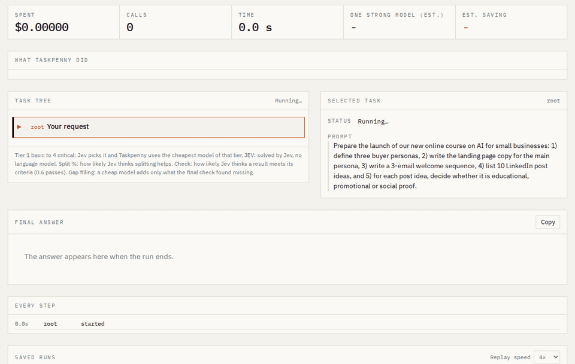

# Taskpenny

[](https://github.com/cintocasals/taskpenny/actions/workflows/ci.yml)

**Split a big prompt into small tasks and send each one to the cheapest model that can do it well.**

> Status: work in progress, private. v0.5 works from n8n and any tool that speaks the OpenAI API, with direct
> keys, local models, Docker and a public benchmark.



<sub>A real run replayed at 4x: five tasks across three tiers, $0.044 instead of about $0.097 with one strong model.
To replay it yourself: `mkdir -p runs && cp docs/demo-run.json runs/ && taskpenny ui`, then Replay.</sub>

Most prompts don't need your most expensive model for every part of the job. Taskpenny works like a good project lead: it decides whether a request is worth splitting, breaks it into small, well defined tasks, gives each task to the cheapest model that can handle it, checks every result before moving on, and puts everything together into one answer. You watch the whole process live, and at the end you get a receipt that compares what it cost with what it would have cost to send everything to the strongest model.

The decisions (split or not, which tier of model, is this result good enough) are made by [Jev](https://typesafe.ai), TypeSafe AI's decision model, which costs about 3 cents per thousand decisions. When a task is simply a choice (pick an option, answer yes or no, give a score), Jev solves it directly: no language model needed.

## Quickstart

```bash
pip install -e .              # from a clone of this repository (a PyPI package comes with v1.0)
taskpenny demo                     # watch Taskpenny work on a sample request: no key, no cost
export AI_GATEWAY_API_KEY=... # one Vercel AI Gateway key: Jev plus Claude, GPT and Gemini models
taskpenny doctor                   # what your keys reach (other ways to connect: see Keys)
taskpenny run "Write a short email to move tomorrow's meeting to Thursday"
taskpenny ui                       # the live task tree in your browser
taskpenny serve                    # OpenAI-compatible API for your tools (see below)
```

Every run is saved in `runs/` as JSON. `taskpenny export runs/<id>.json` turns one into a Markdown report,
and `taskpenny models --check` compares the catalog prices with the live Vercel catalog.

## Keys

The simplest setup is one [Vercel AI Gateway](https://vercel.com/ai-gateway) key: it reaches Jev and every
model in the catalog, and reports the real cost of each call.

You can also use your own provider keys, with or without Vercel:

| You set | What Taskpenny does |
|---|---|
| `AI_GATEWAY_API_KEY` | Everything through Vercel; Jev decides. |
| `AI_GATEWAY_API_KEY` and `TASKPENNY_DIRECT=anthropic,openai` plus those providers' keys | Those providers go straight to their own API with your key; the rest through Vercel; Jev decides. |
| Only provider keys: `ANTHROPIC_API_KEY`, `OPENAI_API_KEY`, `GEMINI_API_KEY`, `DEEPSEEK_API_KEY`, `DASHSCOPE_API_KEY` | Only those providers are used. Without Vercel there is no Jev, so the cheapest basic model you can reach answers the decision questions in its place: it works, but it is less sharp and a little dearer than Jev. |

`TASKPENNY_CEILING=anthropic/claude-sonnet-5` (or `--ceiling`) makes that model the strongest Taskpenny may use: set it to
the model you use today, and Taskpenny sends to it only what needs it.

`taskpenny doctor` shows what your keys reach, which model decides and whether each model name exists on its
provider's API, without spending tokens. When a provider names a model differently from the catalog, add
`direct_id: <name>` to that model in `models.yaml`. Costs of direct calls are worked out from the catalog prices.

### Local models (free)

With [Ollama](https://ollama.com) running, `TASKPENNY_LOCAL` lets basic tasks run on your own machine at no cost:

```bash
ollama pull qwen3:4b
export TASKPENNY_LOCAL=qwen3:4b          # tier 1 tasks go local; "qwen3:8b@2" also covers tier 2; "auto" = all installed
taskpenny doctor                         # checks that Ollama answers and the models are installed
```

Local models go first for their tiers because they cost nothing. Jev still checks every result, and a weak
answer moves on to a cloud model. Use a model of at least 3 to 4 billion parameters: tiny ones answer fast but
badly. Local models never make the decisions while a Vercel or provider key is available.

## Use it from any tool

`taskpenny serve` starts an OpenAI-compatible endpoint. Any tool or library that talks to OpenAI can send its
prompts through Taskpenny by changing only the base URL:

```bash
taskpenny serve                    # http://127.0.0.1:8765/v1 · the live page is on the same address
```

```python
from openai import OpenAI
client = OpenAI(base_url="http://127.0.0.1:8765/v1", api_key="unused")
reply = client.chat.completions.create(
    model="taskpenny",             # or "taskpenny/anthropic" to use only Claude models
    messages=[{"role": "user", "content": "Draft a polite reminder for an unpaid invoice."}],
)
print(reply.choices[0].message.content)
print(reply.model_extra["taskpenny"])   # run id, cost in USD, baseline estimate, saving
```

- Both OpenAI APIs work: Chat Completions (`/v1/chat/completions`) and Responses (`/v1/responses`), so tools
  that default to either one (n8n's OpenAI Chat Model uses Responses) need only the new base URL.
- Every request is one Taskpenny run: it is saved in `runs/` and you can watch it live on the page while it works.
- System messages and earlier turns are passed to Taskpenny as context; the last user message is the request.
- `stream: true` works, but the answer arrives in one piece at the end: Taskpenny checks the work before answering.
- Optional per request: `"taskpenny": {"max_cost": 0.2, "no_split": true}` in the body, or the header `X-Taskpenny-Max-Cost`.
- Not yet: tool calling and images. Taskpenny answers them with a clear error instead of guessing.
- The server listens only on your machine. If you open it to others, set `--api-key` (or `TASKPENNY_API_KEY`): then
  the API and the page need the key (the page asks for it once). `TASKPENNY_MAX_COST` caps the budget of any request
  (2 USD by default).

### With Docker

```bash
docker compose up                                  # page and API on http://127.0.0.1:8765
# or: docker build -t taskpenny . && docker run -p 127.0.0.1:8765:8765 -e AI_GATEWAY_API_KEY taskpenny
```

Keys come from your environment and are never written into the image. Runs are kept in the `taskpenny-runs`
volume. The compose file publishes the port on your machine only; if you open it wider, set `TASKPENNY_API_KEY`.

## How it works

```
request
  |
  v
[gate]       Jev: split it? which tier (1-4)? what kind of work? what form of answer?
  |                                   |
  | clearly worth splitting           | one task
  v                                   v
[planner]    subtasks with prompt,  [router]    closed question -> Jev answers it
  success criteria and                         anything else -> cheapest model of the tier
  dependencies; each one goes                  |
  back to the gate                             v
  |                                 [worker]    result + notes for the tasks that depend on it
  |                                            |
  |                                            v
  |                                 [check]     Jev: does it meet the criteria?
  |                                            no -> repair, then one tier up (at most 2)
  v
[assembly]   an outline from a cheap model; the parts are stitched in, not rewritten
  |
  v
[final check] Jev against the request; only what is missing gets written
  |
  v
answer + cost receipt + full task tree
```

Details, thresholds and fallbacks: [docs/how-it-works.md](docs/how-it-works.md). Every option and variable:
[docs/configuration.md](docs/configuration.md).

## Why

- **Money, not tokens.** Splitting usually uses more tokens in total. The saving comes from moving most of them to models that are 4 to 40 times cheaper, and from letting Jev answer the choice tasks outright.
- **Visible.** Every step, model, decision confidence and cent is on screen.
- **Verifiable.** A public, reproducible benchmark compares Taskpenny with a single strong model on cost, quality and time, and publishes the tasks where Taskpenny loses too.

## Results so far

First public benchmark, 25 September 2026: 142 tasks, Taskpenny against Claude Sonnet 5 alone, judged blind by
Gemini 3.1 Pro. Full report, method and raw data: [bench/public/RESULTS.md](bench/public/RESULTS.md).

| What Taskpenny did | Tasks | Taskpenny cost | As good or better |
|---|---|---|---|
| Basic and standard tasks, one cheap model | 103 | **93% less** | 76% |
| Labelling customer messages (true labels) | 10 | **98% less** | same accuracy, 96 of 100 |
| Advanced tasks, one model | 16 | 12% less | 69% |
| Critical tasks, sent to Claude Opus | 8 | 2.0x as much | 100% |
| Requests split into parts | 15 | 2.2x as much | 73% |
| **All** | 142 | **14% less** | **76%** |

Taskpenny saves the most where most requests are. On hard requests it spent more than Sonnet 5 in that first run, so
two changes followed: a ceiling (Taskpenny's strongest model is the one you already use) and splitting only when it
pays. Checked on **50 new tasks** Taskpenny had never seen, against Sonnet 5: **53% cheaper** and **as good or better
in 82%** of them; on the hard Arena-Hard prompts, half the cost and as good or better in 80%.

## Reading the live page

- **What Taskpenny did**: how many Jev decisions, plans, model calls, Jev-solved tasks and checks the run needed.
- **Task tree**: every task with its tier (1 basic to 4 critical), who did it (a model, or JEV) and what it cost.
  Click a task to see its prompt, what Jev decided about it, each attempt and its result.
- **Cost receipt**: planning, work, Jev decisions, checks and assembly add up to the total. The comparison is an
  estimate of sending the same request once to the baseline model (Claude Opus 5.5) with an answer as long as Taskpenny's,
  scaled by the hidden reasoning Taskpenny's own models used in that run.

## What we have learned so far

- Jev's gate chooses well when to split and what kind of answer is expected (41 of 42 on our development set).
- The saving comes from everyday requests going to models that cost a small fraction of a frontier model.
- Splitting only pays when the parts can go to cheaper tiers than the whole; at advanced level it did not.
- Cheap models give correct but bare answers. The automatic judge prefers more explanation; in a blind check of 20
  pairs, the author often preferred the short answer that did only what was asked.
- Every number is measured, including the ones that do not flatter Taskpenny: see the benchmark report.

## Roadmap

| Version | What |
|---|---|
| v0.1 | Core loop from the terminal: gate, planner, router, executor, verifier, aggregator, cost receipt (done) |
| v0.2 | Live task tree in the browser, run replay, export, English, Catalan and Spanish UI (done) |
| v0.3 | Public benchmark: Taskpenny against a single strong model (first results in) |
| v0.4 | OpenAI-compatible endpoint, direct provider keys, local models with Ollama, Docker (already in v0.3); continuous integration and a real n8n workflow through Taskpenny |
| v1.0 | Public release |

## Models

The catalog lives in [`src/taskpenny/models.yaml`](src/taskpenny/models.yaml): one entry per model with its tiers, prices and context. Adding a model is adding a few lines.

## License

MIT. Made by [Cinto Casals](https://github.com/cintocasals) · SerIA Nativa.
